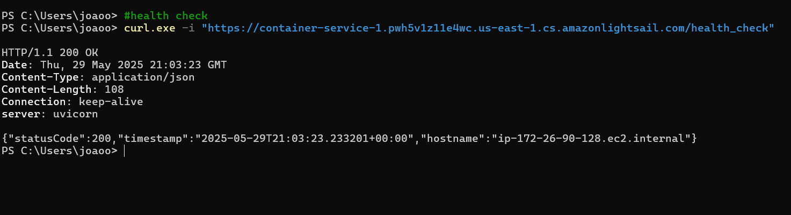
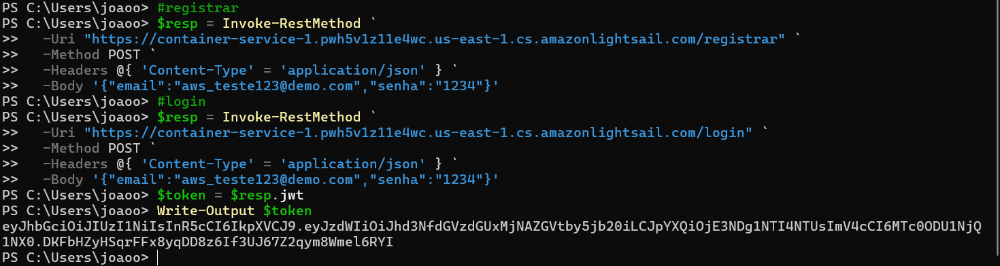
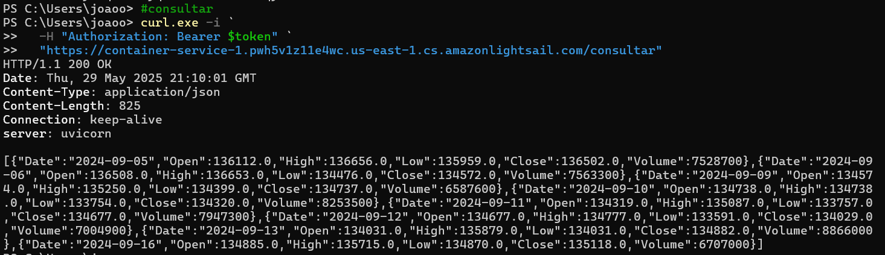
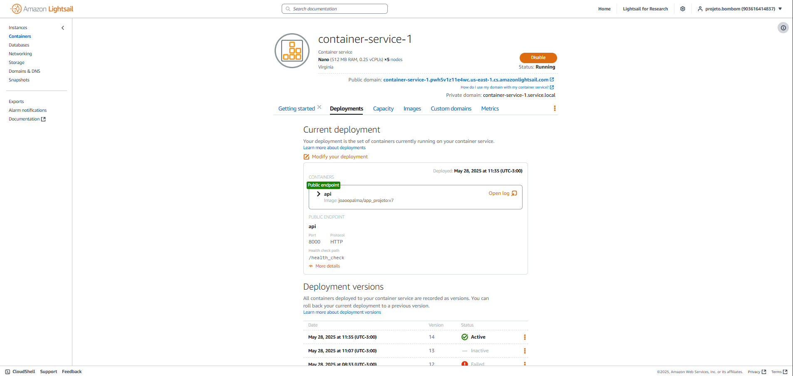
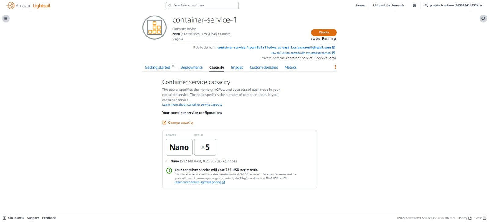

# Explicação do Projeto
A CloudK API é uma aplicação RESTful desenvolvida em Python com FastAPI, que permite:

Registrar usuários com email e senha (armazenando apenas o hash da senha com bcrypt);

Autenticar usuários e gerar tokens JWT com validade configurável;

Consultar dados protegidos (JSON estático do índice Bovespa dos últimos 10 dias) mediante token válido.

## Como Executar a Aplicação

Clone o repositório
```sh
git clone https://github.com/CarreraAlberto/cloudK.git"

```

Ajuste as variáveis no arquivo api/.env

variáveis sensíveis (credentials, secret JWT)

```sh
# Credenciais do Postgres
POSTGRES_USER=postgres
POSTGRES_PASSWORD=postgres
POSTGRES_DB=postgres
DATABASE_HOST=database
DATABASE_PORT=5432

# Configurações do JWT
JWT_SECRET=@cloudk
JWT_ALGO=HS256
JWT_EXPIRY_MIN=60
```
Execute com Docker Compose:

```sh
docker compose up -d
```

## Documentação dos Endpoints
| Endpoint      | Método | Descrição                                       | Requisição                                      |
|---------------|--------|-------------------------------------------------|-------------------------------------------------|
| `/registrar`  | POST   | Cria novo usuário e retorna o token JWT         | JSON `{ "email": "...", "senha": "..." }`       |
| `/login`      | POST   | Valida credenciais e retorna o token JWT        | JSON `{ "email": "...", "senha": "..." }`       |
| `/consultar`  | GET    | Retorna JSON protegido (Bovespa últimos 10 dias)| Header `Authorization: Bearer <JWT>`            |


## Capturas de tela dos endpoint


## Link do vídeo para teste dos endpoints
https://youtu.be/R042mTfEmpw

## Link para o Docker Hub do projeto
https://hub.docker.com/r/joaoopalma/cloudk-api

## Localização do `docker-compose.yml`

A estrutura de diretórios do projeto é:

```text
docs/
└── projeto/
    ├── api/
    │   ├── app/
    │   │   ├── __init__.py
    │   │   ├── app.py
    │   │   ├── auth.py
    │   │   ├── bovespa.json
    │   │   ├── crud.py
    │   │   ├── database.py
    │   │   ├── external.py
    │   │   ├── models.py
    │   │   └── schemas.py
    │   ├── .env
    │   ├── Dockerfile
    │   ├── requirements.txt
    │   └── docker-compose.yml    ← aqui
    ├── assets/
    │   └── img1.jpg
    └── main.md
```

## Arquivo docker-compose.yaml

```sh
version: "3.8"

services:
  app:
    image: joaoopalma/cloudk-api:v7
    ports:
      - "8000:8000"
    env_file:
      - ./api/.env
    depends_on:
      - database

  database:
    image: postgres:15
    restart: always
    environment:
      POSTGRES_USER: ${POSTGRES_USER}
      POSTGRES_PASSWORD: ${POSTGRES_PASSWORD}
      POSTGRES_DB: ${POSTGRES_DB}
    volumes:
      - db_data:/var/lib/postgresql/data

volumes:
  db_data:
```
# Parte 2: Deploy na Nuvem (AWS Lightsail)

Nesta seção documentamos:

1. **Explicação do projeto**  
   Relembramos que a CloudK API é uma RESTful em FastAPI, com endpoints de registro, login (JWT), consulta Bovespa e health-check.

2. **Como executar na AWS**  
  - A imagem Docker `joaoopalma/cloudk-api:v7` está no Docker Hub.  
  - Serviço criado em Lightsail Container Service:
     - **Nome**: fastapi-service  
     - **Power**: m1.nano (0.25 vCPU, 512 MB RAM)  
     - **Scale**: 5 instâncias  

  - Banco gerenciado em Lightsail Databases:
     - **Engine**: PostgreSQL 17.5  
     - **DB name**: fastapi-db  
     - **Master user**: admin_user
     - **Senha**: cloudkcloudk  
     - **Public mode**: habilitado

3. **Endpoints testados**  
  - Health check: 
   

  - Registrar e Login
  

  - Consultar
  

4. **Infraestrutura funcionando**  
   

5. **Tela de custos (dia 27/05/2025)**  
   

6. **Link para vídeo de execução**

https://youtu.be/LVtL4FoiDQA
