## Objetivo

- Entender os conceitos básicos sobre uma plataforma de gerenciamento de hardware.
- Introduzir conceitos básicos sobre redes de computadores.

## Tarefa 1

### Banco de dados funcionando e seu Status está como "Ativo" para o Sistema Operacional
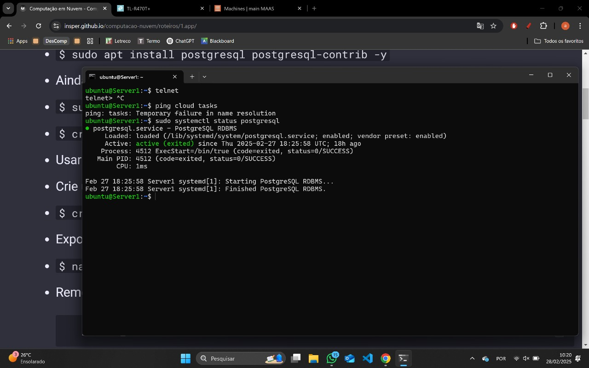

### Banco de dados acessivel na máquina na qual ele foi implantado.
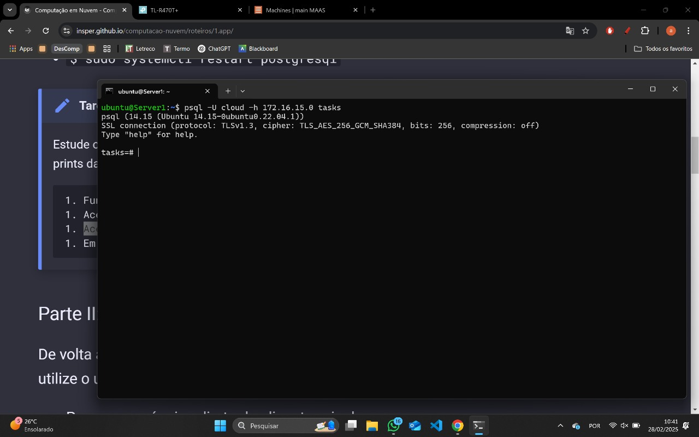

### Banco de dados acessivel a partir de uma conexão vinda da máquina MAIN.
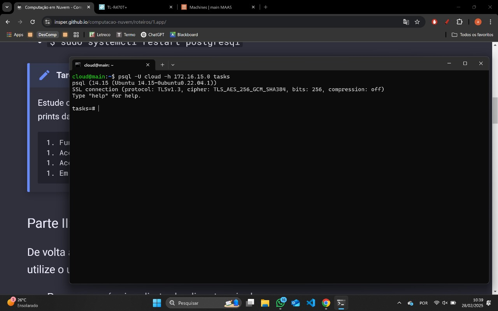

### Porta em que este serviço está funcionando.

 --- tarefa 1 100% completa e registrada no relatório (daqui pra cima ta feito)

Conforme ilustrado acima, a tela inicial do MAAS apresenta um dashboard com informações sobre o estado atual dos servidores gerenciados. O dashboard é composto por diversos painéis, cada um exibindo informações sobre um aspecto específico do ambiente gerenciado. Os painéis podem ser configurados e personalizados de acordo com as necessidades do usuário.

### Tarefa 2

### Dashboard cdo **MAAS** com as máquinas
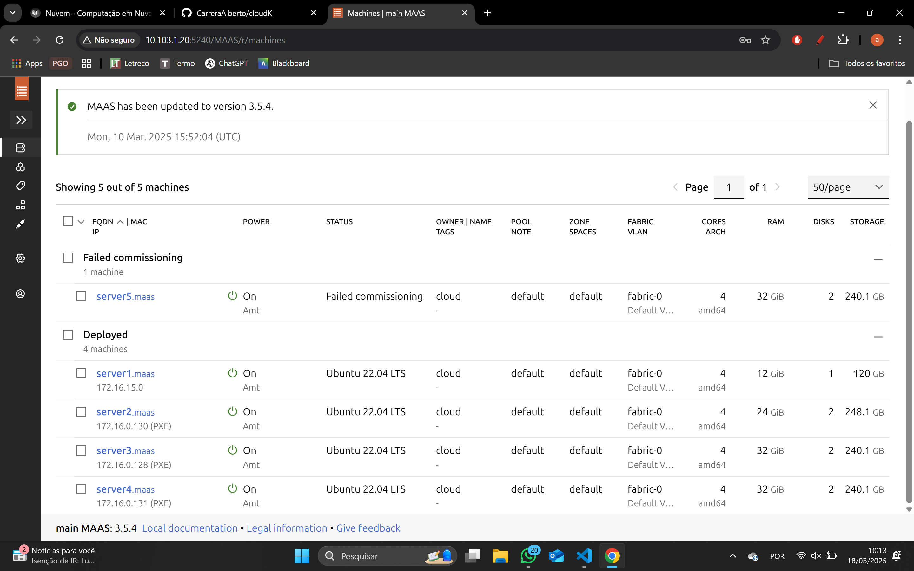

### Imagens sincro
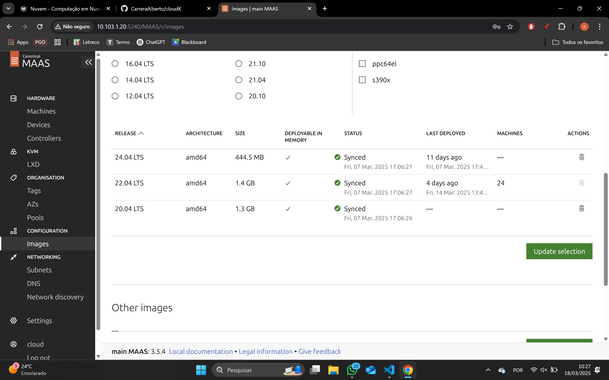

### Testes de hardware e commissioning com Status "OK"
#### Server 1
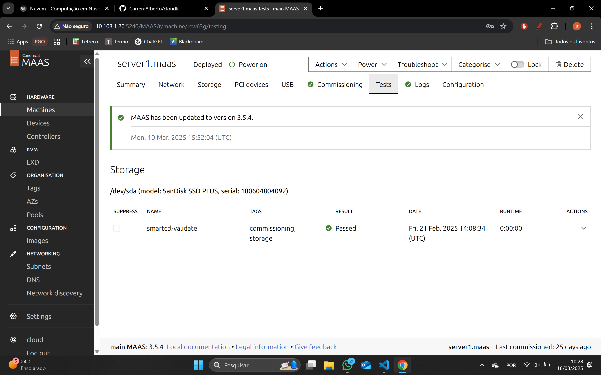
#### Server 2
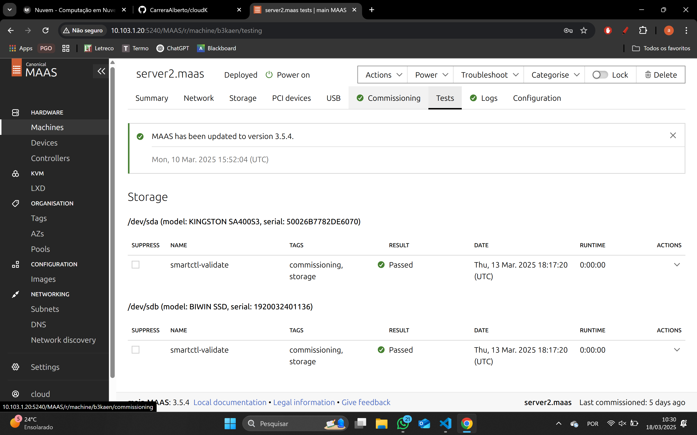
#### Server 3
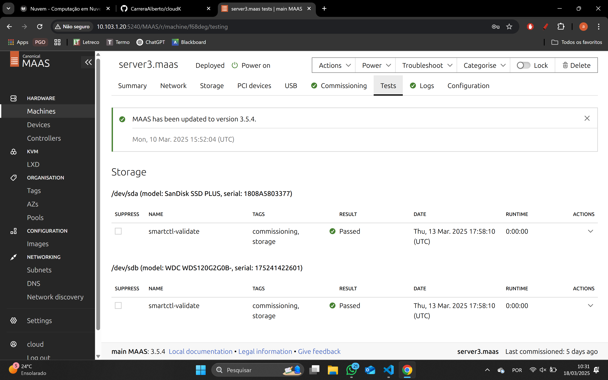
#### Server 4

#### Server 5
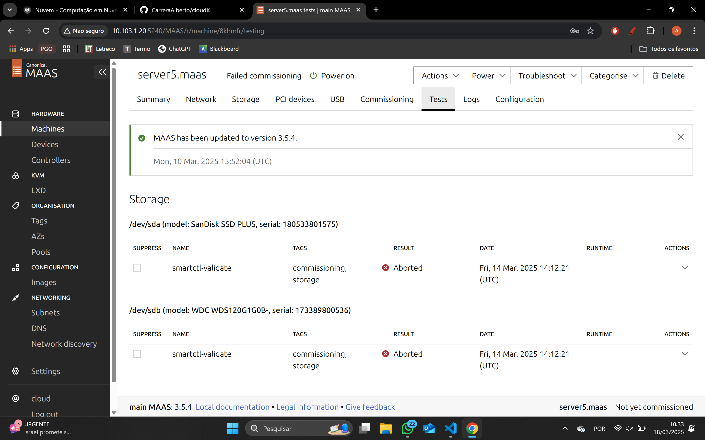

### Tarefa 3
 
### Dashboard do MAAS com as 2 Maquinas e seus respectivos IPs
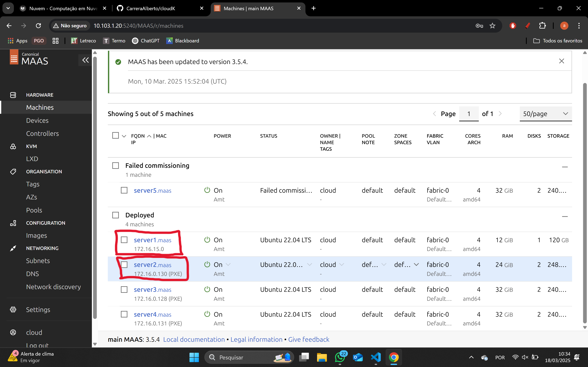
Server1 ip:172.16.15.0 \
Server2 ip:172.16.0.130

### Aplicação Django conectada ao servidor
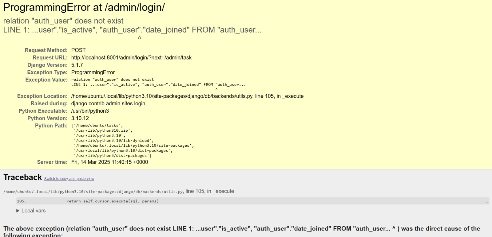

### Implementação manual da aplicação Django e banco de dados:
Aqui vai a explicação

Exemplo de diagrama

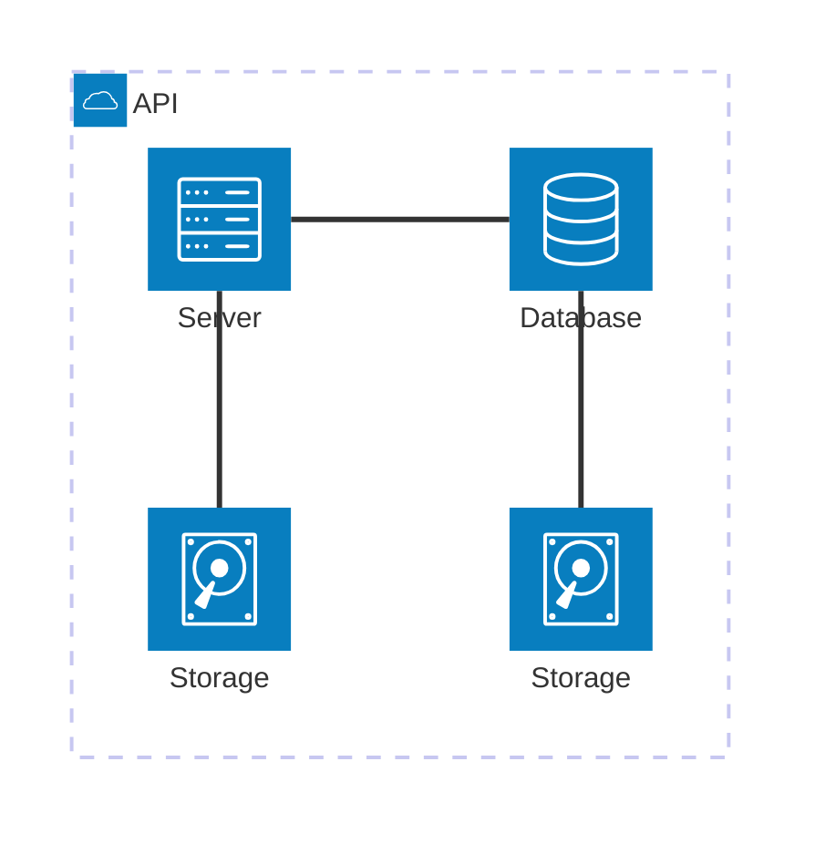

[Mermaid](https://mermaid.js.org/syntax/architecture.html){:target="_blank"}

## Questionário, Projeto ou Plano

Esse seção deve ser preenchida apenas se houver demanda do roteiro.

## Discussões

Quais as dificuldades encontradas? O que foi mais fácil? O que foi mais difícil?

## Conclusão

O que foi possível concluir com a realização do roteiro?
