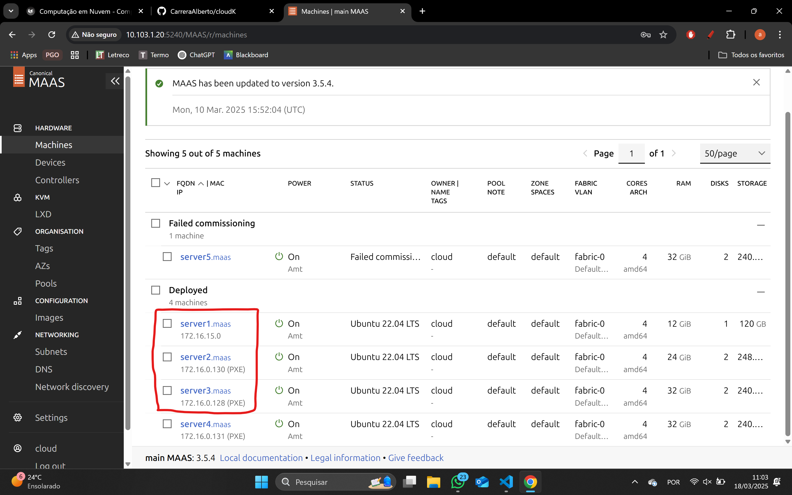
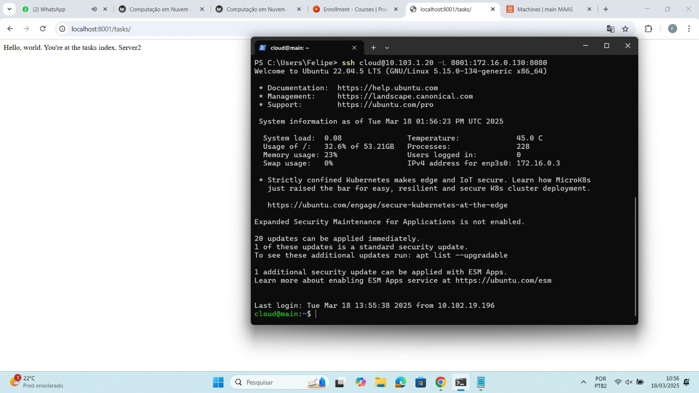
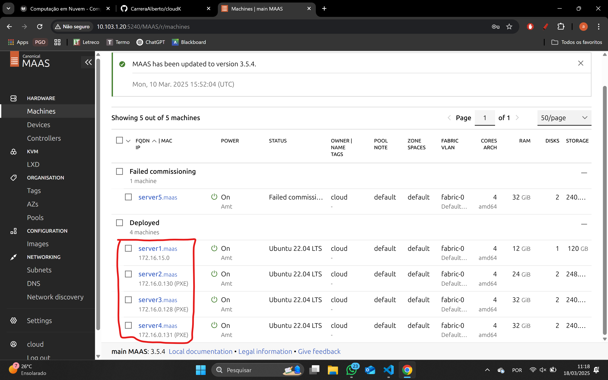
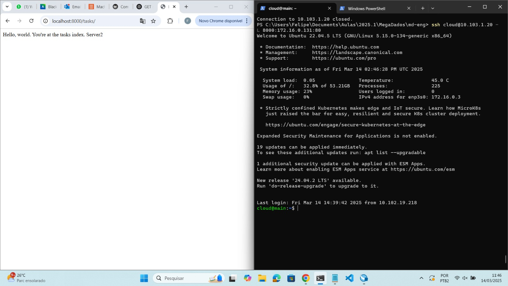
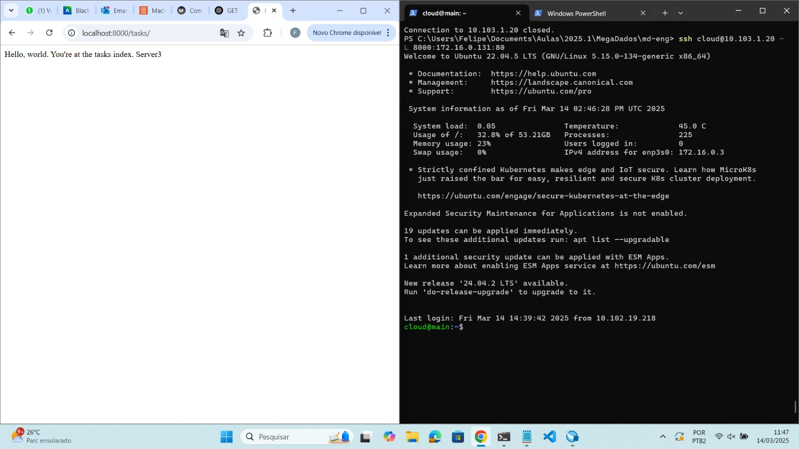

## Objetivo

- Entender os conceitos básicos sobre uma plataforma de gerenciamento de hardware.
- Introduzir conceitos básicos sobre redes de computadores.

## Tarefa 1

### Banco de dados funcionando e seu Status está como "Ativo" para o Sistema Operacional

### Banco de dados acessivel na máquina na qual ele foi implantado.

### Banco de dados acessivel a partir de uma conexão vinda da máquina MAIN.

### Porta em que este serviço está funcionando.

 --- tarefa 1 100% completa e registrada no relatório (daqui pra cima ta feito)

Conforme ilustrado acima, a tela inicial do MAAS apresenta um dashboard com informações sobre o estado atual dos servidores gerenciados. O dashboard é composto por diversos painéis, cada um exibindo informações sobre um aspecto específico do ambiente gerenciado. Os painéis podem ser configurados e personalizados de acordo com as necessidades do usuário.

## Tarefa 2

### Dashboard cdo **MAAS** com as máquinas

### Imagens sincro

### Testes de hardware e commissioning com Status "OK"
#### Server 1

#### Server 2

#### Server 3

#### Server 4

#### Server 5

## Tarefa 3
 
### Dashboard do MAAS com as 2 Maquinas e seus respectivos IPs

Server1 ip:172.16.15.0 \
Server2 ip:172.16.0.130

### Aplicação Django conectada ao servidor

### Implementação manual da aplicação Django e banco de dados:
Inicialmente demos comission no server 1 e server 2 pelo maas

Depois acessamos o server 1 via SSH e rodamos os seguintes comandos para atualizar o nosso ubuntu e instalar o PostgreSQL:
sudo apt update
sudo apt install postgresql postgresql-contrib -y

Em seguida criamos nosso usuário "cloud" e utilizamos a senha "cloud" com:
sudo su - postgres
createuser -s cloud -W

O próximo passo foi criar o database usando
createdb -O cloud tasks

alterar o postgresql.conf e alterar o listen_addresses para que reconhecesse tudo o deixando da seguinte forma:
listen_addresses = '*'

e alterar o pg_hba.conf para liberar qualquer maquina dentro da subnet adicionando a linha
host    all             all             172.16.0.0/20          trust

Com o server 1 pronto fomos para o server 2. Acessamos ele pelo SSH e clonamos o repositório https://github.com/raulikeda/tasks.git com um git clone

Para testar se estava funcionando criamos um túnel para o server 2 utilizando o comando:
ssh cloud@10.103.1.20 -L 8001:172.16.0.130:8080
 
e acessamos http://localhost:8001/admin/ para verificar a conexão

## Tarefa 4

### Server 1, 2 e 3 com seus respectivos IPs

### Aplicação Django rodando no server 2

### Aplicação Django rodando no server 3

### Explique qual diferenca entre instalar manualmente a aplicacao Django e utilizando o Ansible
A instalação manual exige configurar tudo passo a passo, o que torna o processo mais demorado e sujeito a erros. Com Ansible, tudo é automatizado, podendo ser instalado diretamente pelo main, sem precisar acessar o servidor específico. Isso torna a implantação mais prática e eficiente.

## Tarefa 5
### Server 1, 2, 3 e 4 com seus respectivos IPs

### GET request conectado ao Server 4, batendo no Server 2

### GET request conectado ao Server 4, batendo no Server 3

## Conclusão

(Descreva como o MaaS poderia ser utilizado em um datacenter real (com muitos servidores) e como seria um processo alternativo sem essa ferramenta. Ainda, é possível e *SIMPLES* realizar a implantação de uma aplicação usando o MaaS?)
