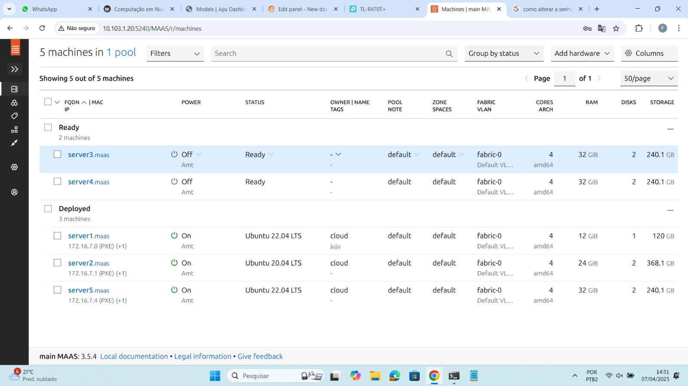
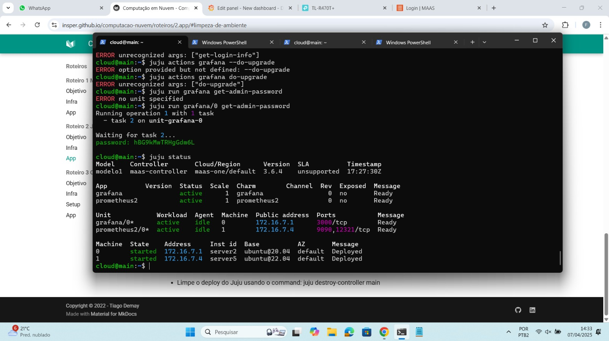
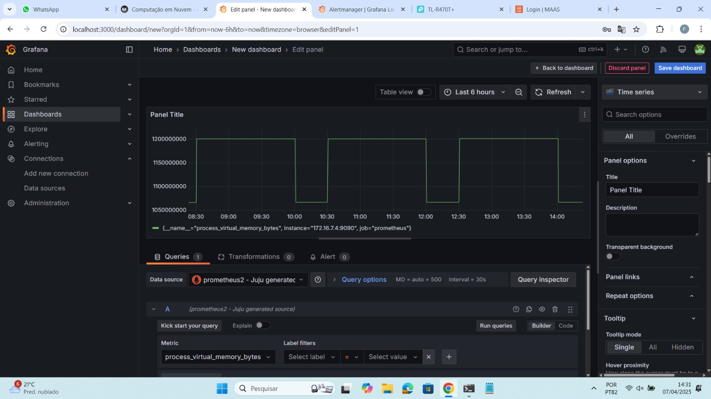
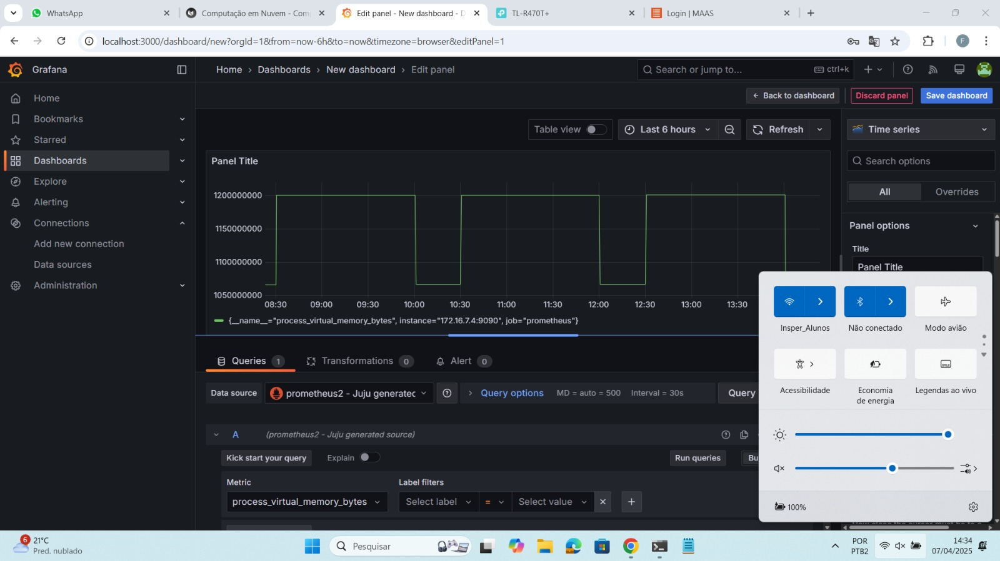
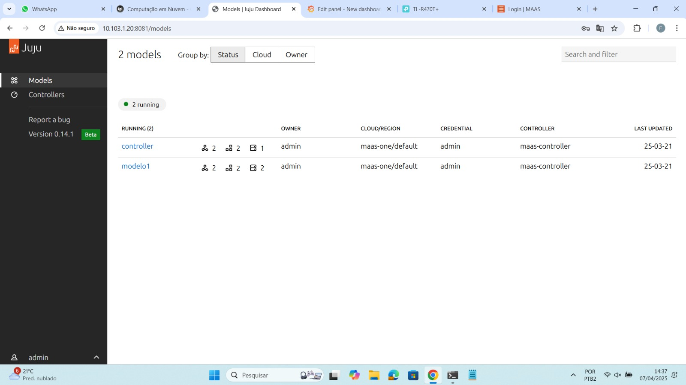

# Roteiro 2

## Objetivo
- Entender os conceitos básicos sobre uma plataforma de gerenciamento de aplicações distribuídas.
- Entender os conceitos básicos de comunicação entre aplicações e serviços.

## Tarefa
### De um print da tela do Dashboard do MAAS com as Maquinas e seus respectivos IPs.

### De um print de tela do comando "juju status" depois que o Grafana estiver "active".

### De um print da tela do Dashboard do Grafana com o Prometheus aparecendo como source.

### Prove (print) que você está conseguindo acessar o Dashboard a partir da rede do Insper.

### De um print na tela que mostra as aplicações sendo gerenciadas pelo JUJU (http://IP-Serviço:8080/models/admin/maas)

