# Roteiro 3

## Objetivos
1. Entender os conceitos básicos de Private Cloud.
2. Aprofundar conceitos sobre redes virtuais SDN.

## Tarefa 1
### Print da tela do Status do Juju
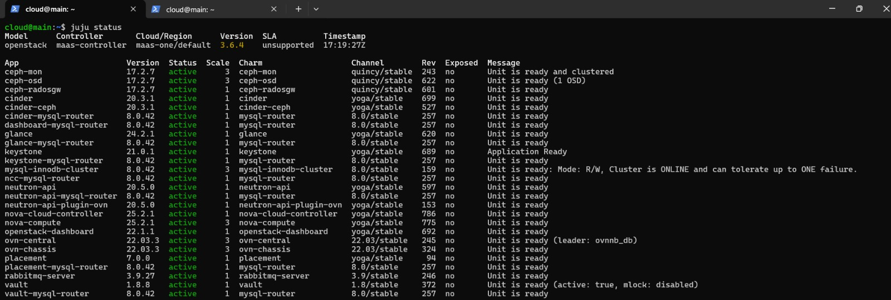
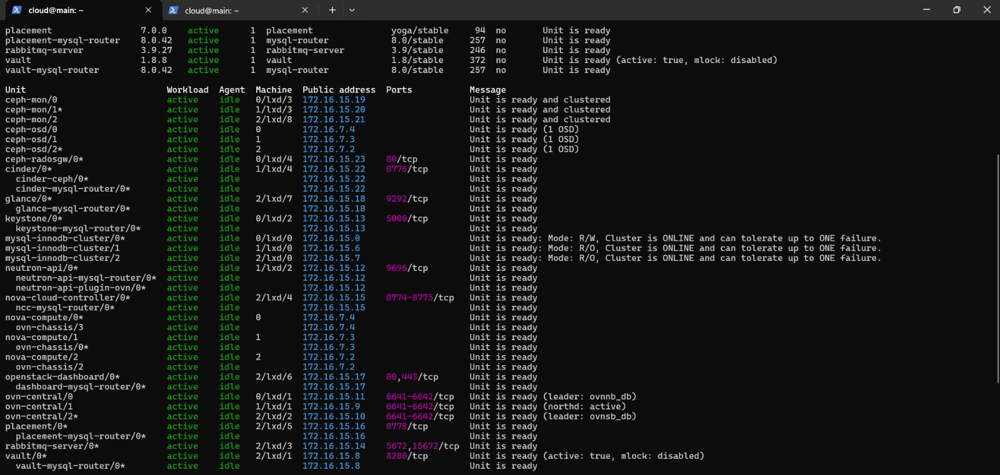
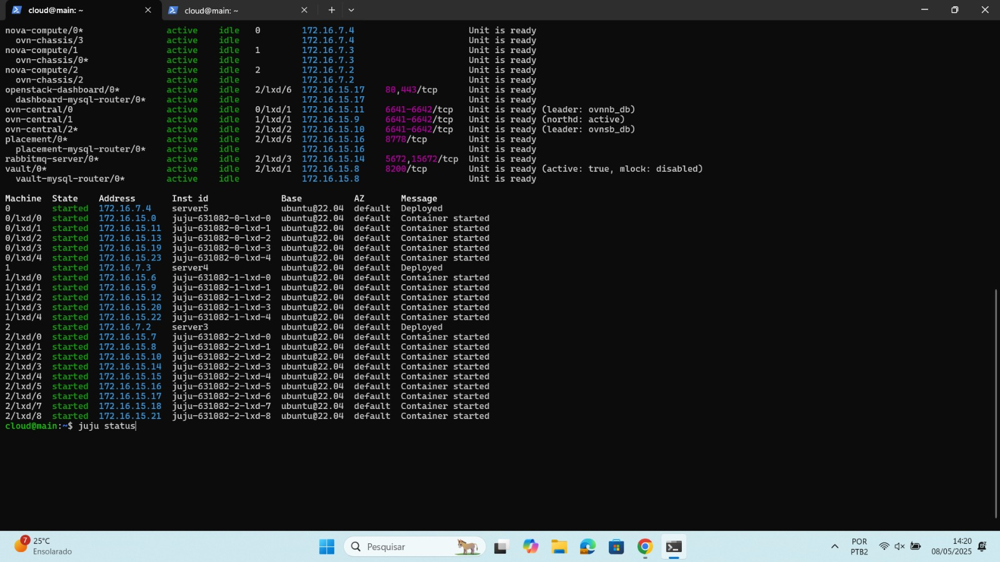

### Print da tela do Dashboard do MAAS com as máquinas
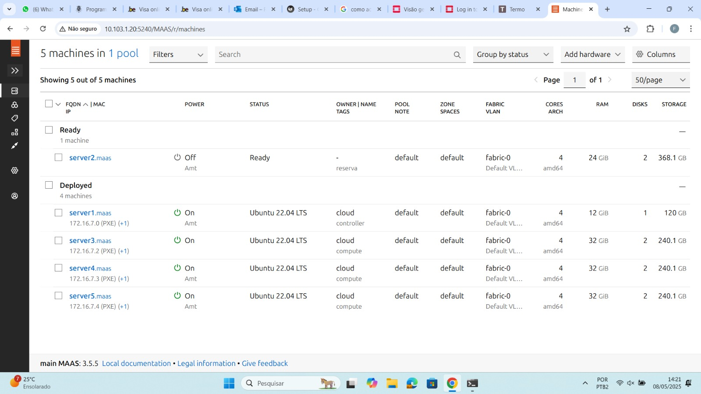

### Print da aba compute overview no OpenStack Dashboard
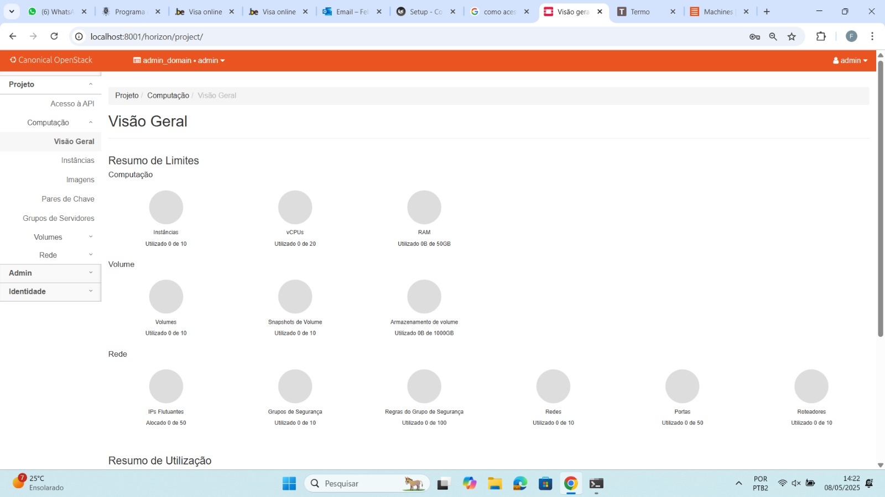

### Print da aba compute instances no OpenStack Dashboard
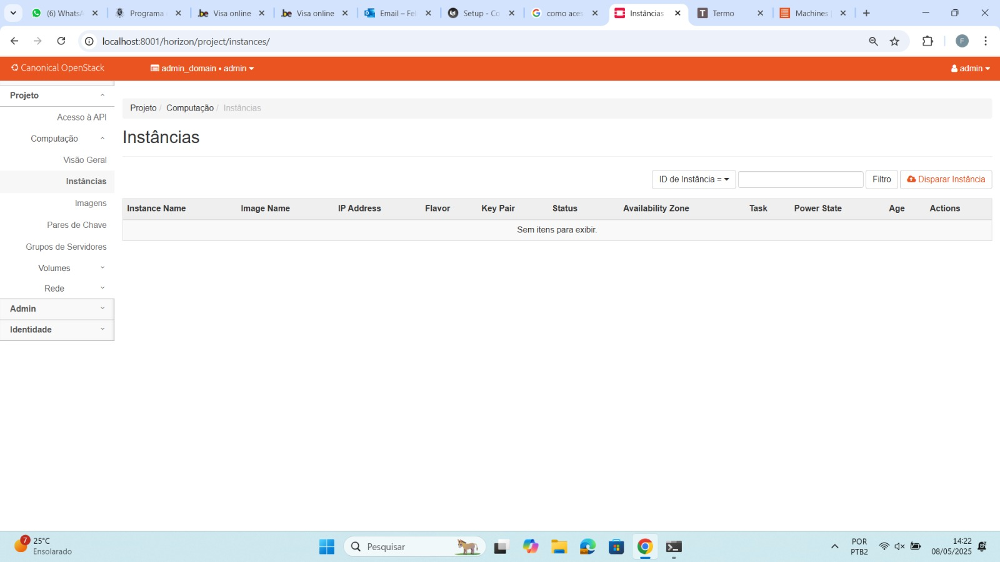

### Print da aba network topology no OpenStack Dashboard
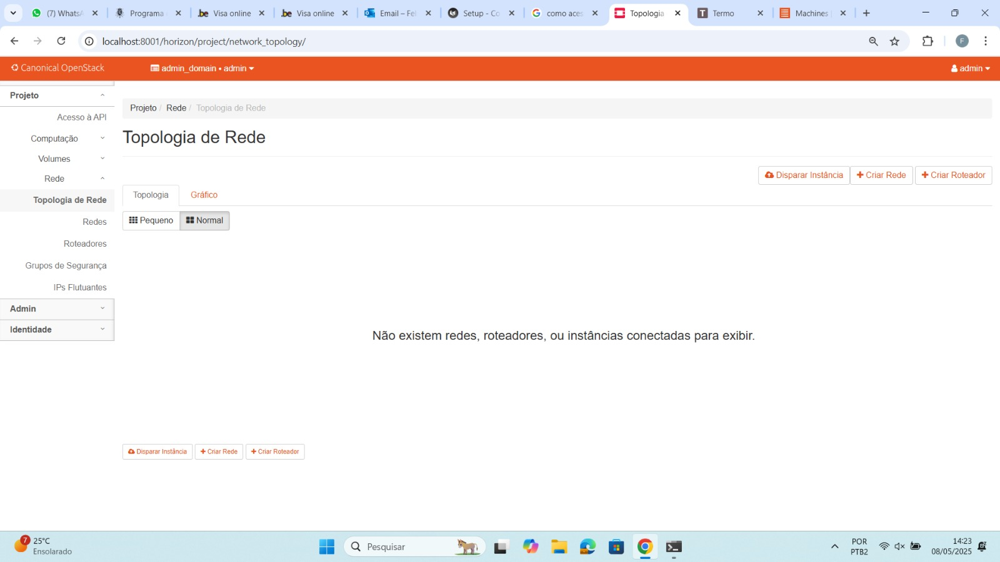


## Tarefa 2
### Print da tela do Dashboard do MAAS com as máquinas
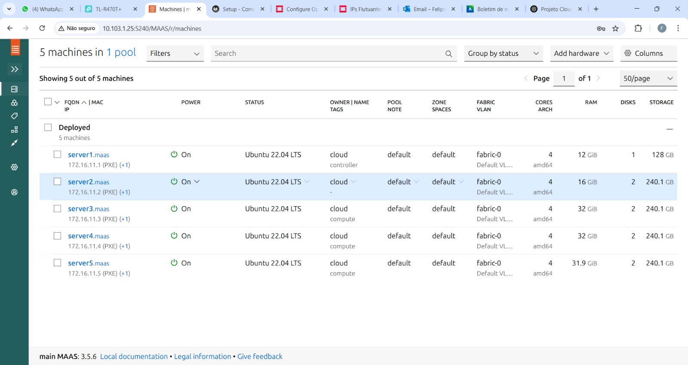
**Diferenças da Tarefa 1 para a Tarefa 2:** \
Os IPs das máquinas foram alterados e a máquina 2 foi instanciada.

### Print da aba compute overview no OpenStack Dashboard
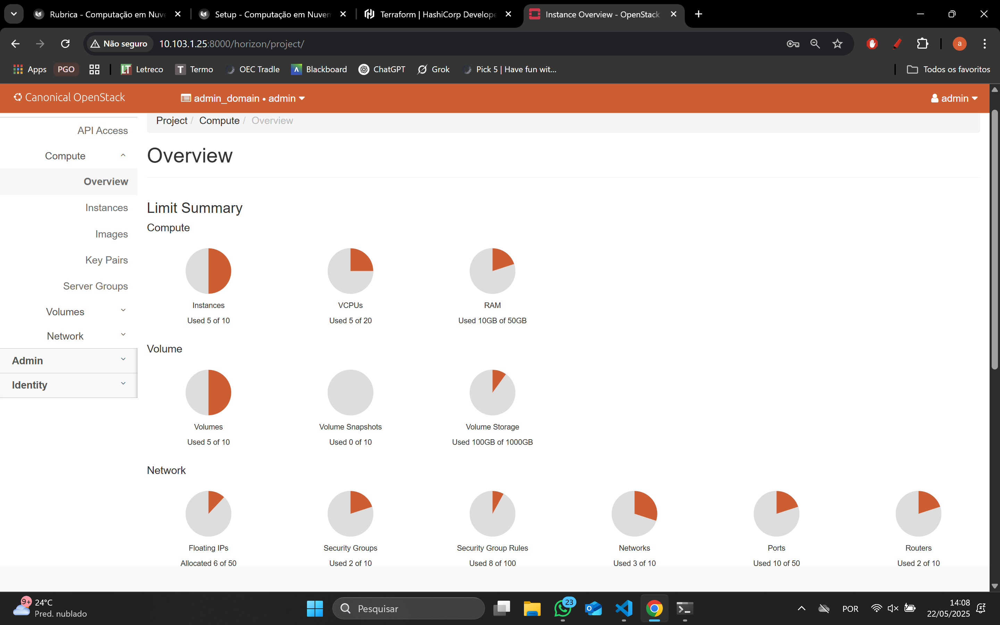
**Diferenças da Tarefa 1 para a Tarefa 2:** \
Na Tarefa 1 o roteiro estava no começo e com todas as máquinas vazias prontas para a realização do roteiro. Agora na Tarefa 2 o roteiro já está em andamento. \
Pode-se vizualizar na imagem as Instâncias (VMs), Nertworks, Routers e Floating IPs que foram criados e configurados entre as duas Tarefas até agora realizadas.

### Print da aba compute instances no OpenStack Dashboard
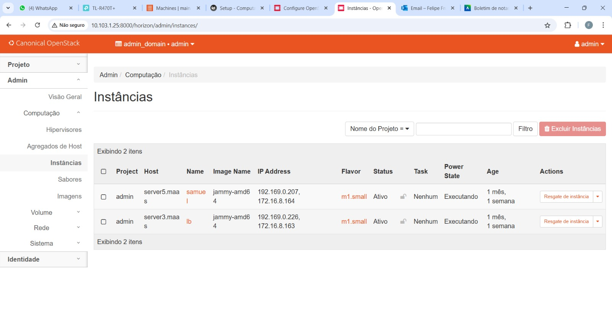
**Diferenças da Tarefa 1 para a Tarefa 2:** \
Pode-se vizualizar as duas Instâncias (VMs) que foram criadas para testar o funcionamento do Roteiro 3. 

### Print da aba network topology no OpenStack Dashboard
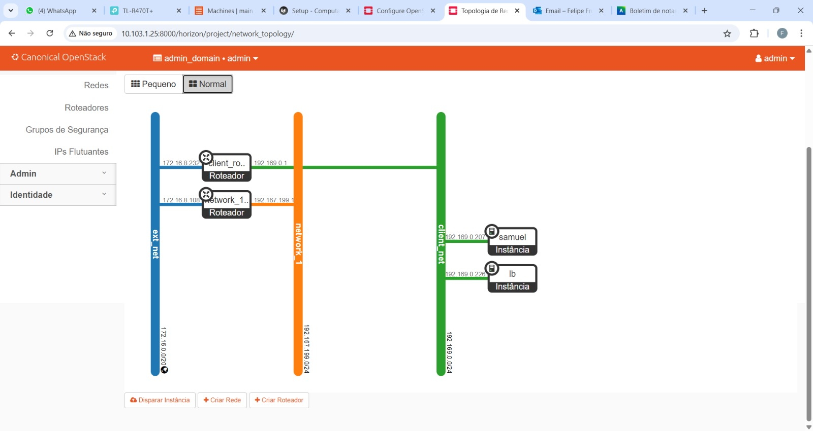
**Diferenças da Tarefa 1 para a Tarefa 2:** \
Na Tarefa 1 não existem nenhuma rede, roteador ou instâncias. Já na Tarefa 2 ja foram criadas 3 redes: externa, interna e client. Também foram criadaos 2 roteadores: um para o conectar a rede externa à interna e outra para conectar a rede externa à client, essa que possui duas VMs na sua rede.

### Explicação de como cada recurso foi criado
**Criação das Images e Flavours:** \
```
openstack flavor create --ram 1 --disk 20 m1.tiny
```

**Criação da Rede Externa e sua Subnet:** \
O código abaixo foi utilizado para criar uma Public External Network
```
openstack network create --external --share \
   --provider-network-type flat --provider-physical-network physnet1 \
   ext_net
```
Após isso a criação da subnet foi realizada utilizando o código à seguir, porém com os valores diferentes para cumprir as necessidades do Roteiro com uma faixa de alocação entre 172.16.7.0 e 172.16.8.255
```
openstack subnet create --network ext_net --no-dhcp \
   --gateway 172.16.0.1 --subnet-range 172.16.0.0/20 \
   --allocation-pool start=172.16.7.0,end=172.16.8.255 \
   ext_subnet
```

**Criação da Rede Interna e sua Subnet:** \
Para a criação da Rede Interna foi utilizado o código à seguir
```
openstack network create --internal user1_net
```
Em seguida para criar a Subnet da rede interna utilizamos o código à seguir, porém cumprindo o requisito 192.169.0.0/24
```
openstack subnet create --network user1_net \
   --subnet-range 192.169.0.0/24 \
   user1_subnet
```

**Criação do Roteador:** \
Foi utilizado o comando à seguir para criar o reteador que conecta a rede interna à externa
```
openstack router create user1_router
openstack router add subnet user1_router user1_subnet
openstack router set user1_router --external-gateway ext_net
```

**Criação de Instância:** \
Primeiro a criação da instância com flavor "m1.tiny" e nome "client"
```
openstack server create --image jammy-amd64 --flavor m1.tiny \
   --key-name user1 --network user1_net --security-group Allow_SSH \
   client
```
Após isso alocamos um Floating IP para a nova instância "client" criada
```
FLOATING_IP=$(openstack floating ip create -f value -c floating_ip_address ext_net)
openstack server add floating ip client $FLOATING_IP
```

## Tarefa 3
### Flow de como é a sua arquitetura de rede, desde a sua conexão com o Insper até a instância alocada
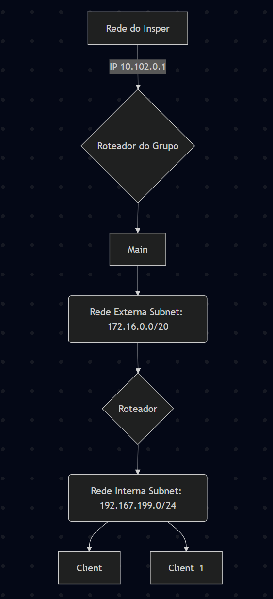


## Tarefa 4
### Relatório dos passos utilizados para levantar as aplicações nas VMs
**Database:** \
Para isso criamos o enviroment com o comando
```
nano .env
```
Após isso criamos o container "postgres" com o seguinte código
```
docker run -d   --name postgres   --env-file .env   -p 5432:5432   -v postgres_data:/var/lib/postgresql/data   postgres:16
```
Com o "curl" baixamos e executamos o script do Docker
```
curl -fsSL https://get.docker.com | sh
```
Por fim, com os dois comandos à seguir adicionamos o usuário atual ao grupo docker e atualizamos a sessão imediatamente
```
sudo usermod -aG docker $USER
newgrp docker
```

**API 1 e 2:** \
O segundo passo é levantar duas instâncias com a API criada pelo grupo e que foi salva no DockerHub. \
Para isso criamos o arquivo api.env
```
nano api.env
```
O próximo passo foi criar uma rede Docker chamada "minha-rede", para facilitar o processo de comunicação entre containers
```
docker network create minha-rede
```
Após isso criamos os containers "api" e "api2", uma em cada máquina, com o seguinte comando
```
docker run -d --name api --env-file ./api.env -p 3000:8000 joaopalma/cloudk-api
docker run -d --name api2 --env-file ./api.env -p 3000:8000 joaopalma/cloudk-api
```

**LoadBalancer:** \
Para a criação do loadbalancer começamos pela criação do arquivo "nginx.config" como loadbalancer, utilizando o segundo comando
```
nano nginx.conf
```
Agora executamos o container Docker nomeando-o "nginx", com a imagem "nginx.alpine"
```
docker run -d --name nginx -p 80:80 -v $(pwd)/nginx.conf:/etc/nginx/nginx.conf:ro nginx:alpine
```
Após isso foi realizado o mesmo processo da etapa passada, instalando o "curl", baixando e executando o script do Docker, depois adicionando o usuário ao grupo "docker" e aplicando as mudanças
```
sudo apt update && sudo apt install -y curl
curl -fsSL https://get.docker.com | sh
sudo usermod -aG docker $USER
newgrp docker
```

### Arquitetura de rede da infraestrutura dentro do Dashboard do Openstack
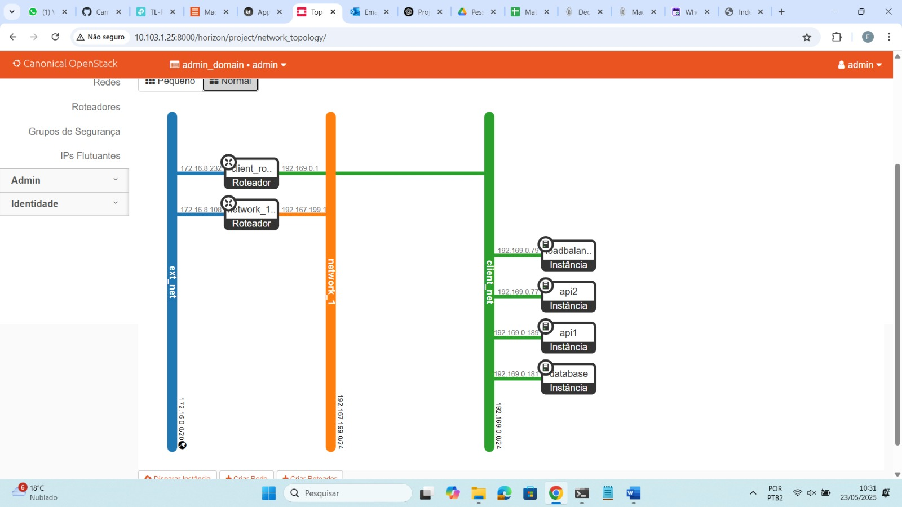

### Lista de VMs utilizadas com nome e IPs alocados
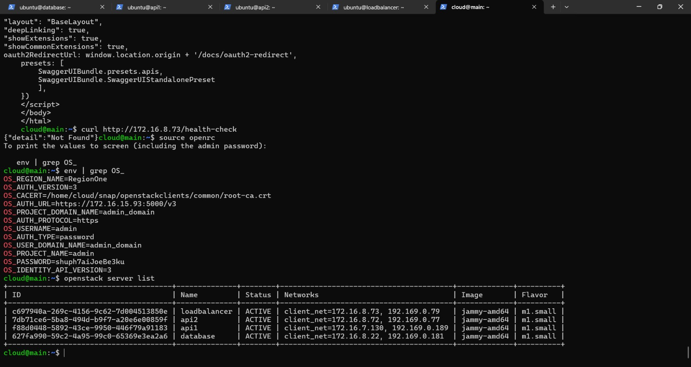

### Print do Dashboard do FastAPI conectado via máquina Nginx/LB
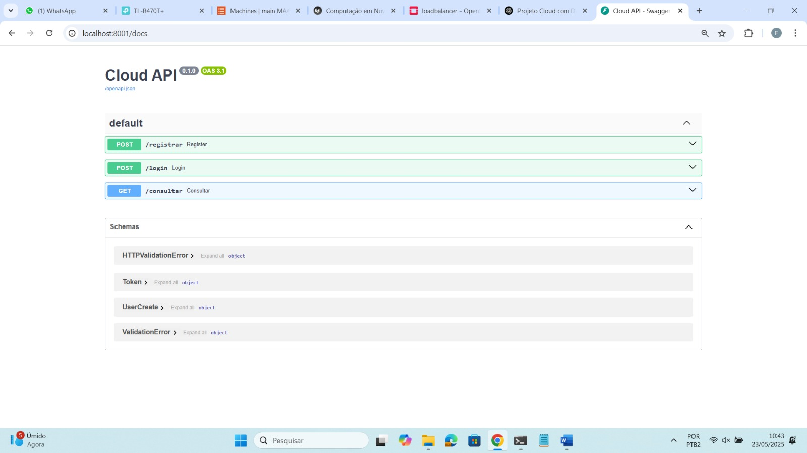

### 4 Prints, cada um demonstrando em qual server (máquina fisica) cada instância foi alocado pelo OpenStack
#### LoadBalancer
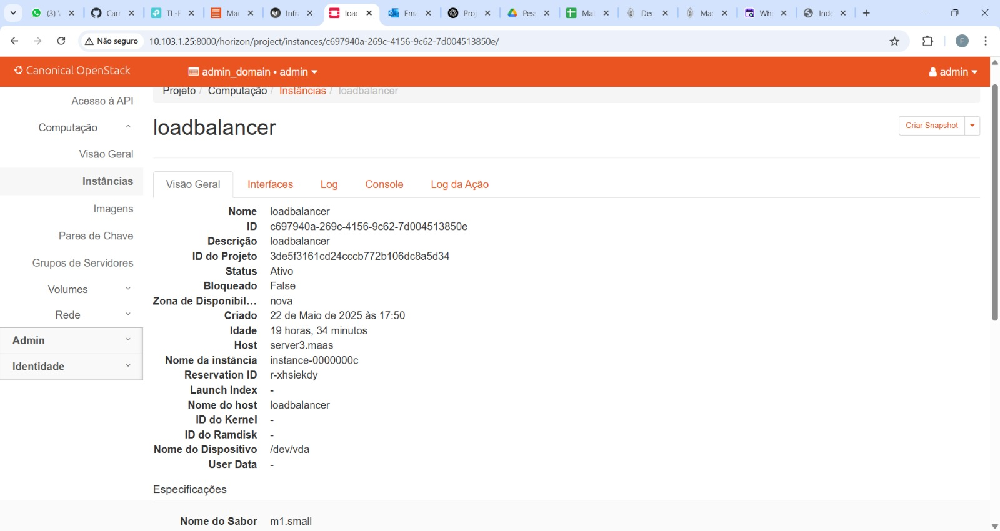
#### API 1
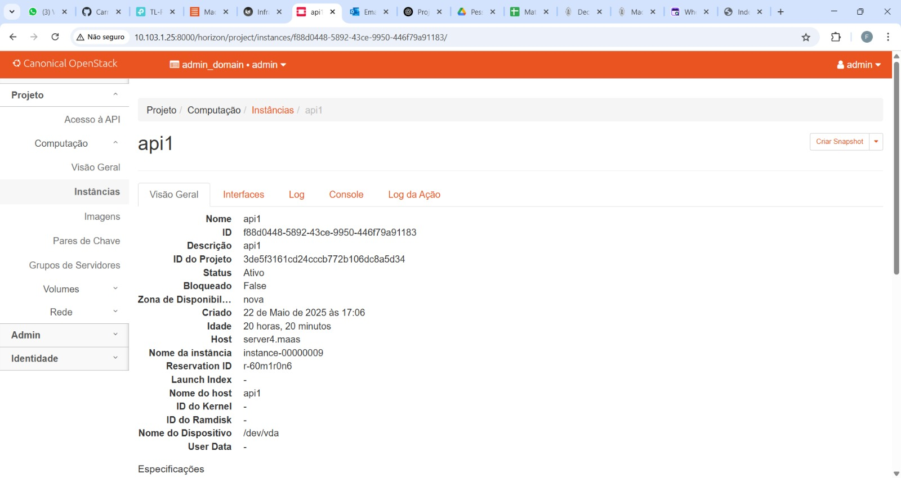
#### API 2
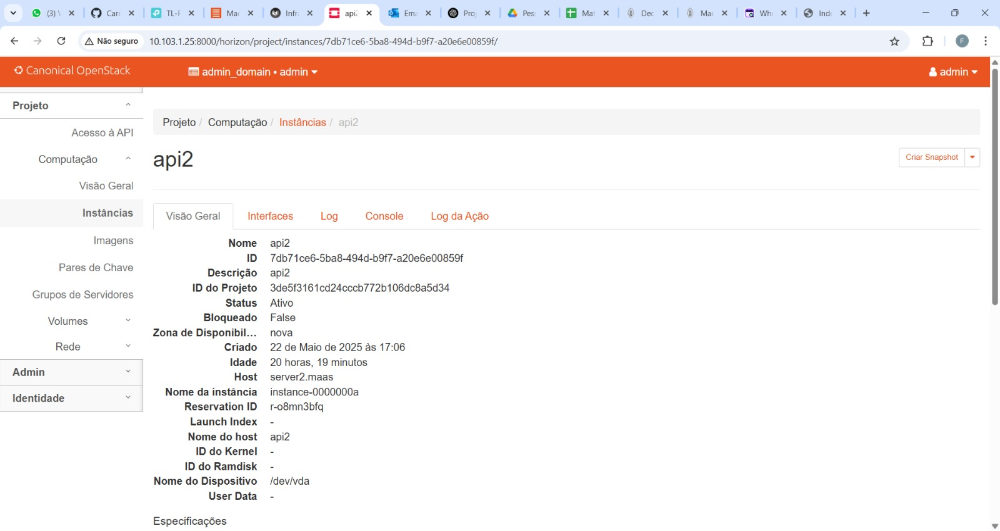
#### DataBase
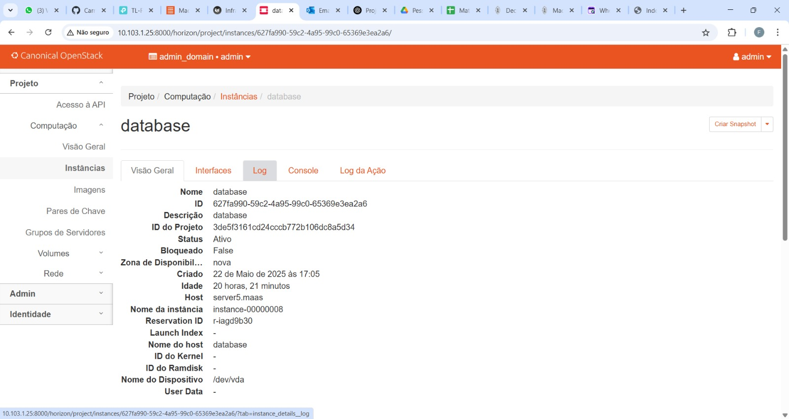