# Roteiro 4
## Objetivos
1. Entender os conceitos básicos Infraestrutura como código
2. Entender os conceitos básicos sobre SLA e DR

## Exercício 1
Foram criados três *Users* sem contar o *admin*. Para verificar suas composições foram tirados prints de diferentes abas do **OpenStack** que cada um possui permissão para acesso. 

### User **Admin**:
#### Aba *Identity Projects*
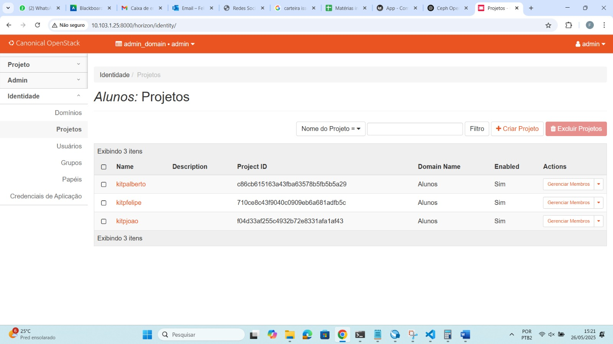

#### Aba *Identity Users* do OpenStack
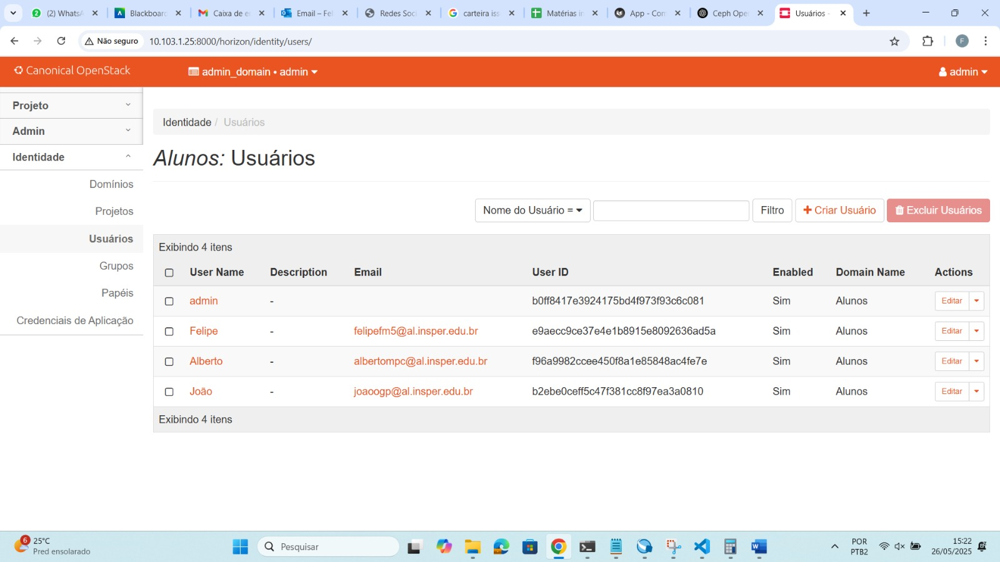

#### Aba *Compute Overview*
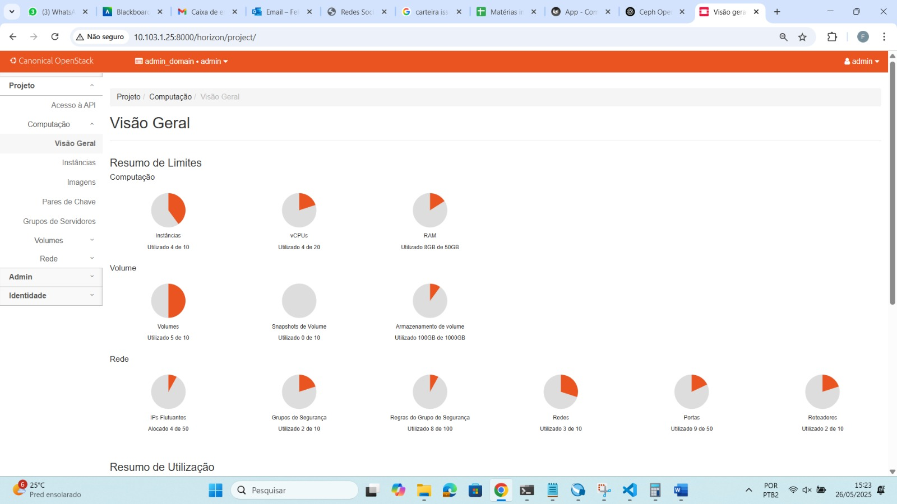
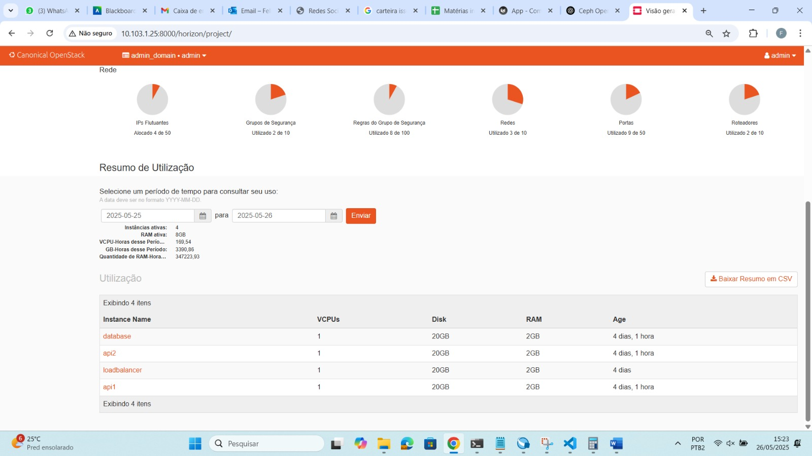

#### Aba *Compute Instances*
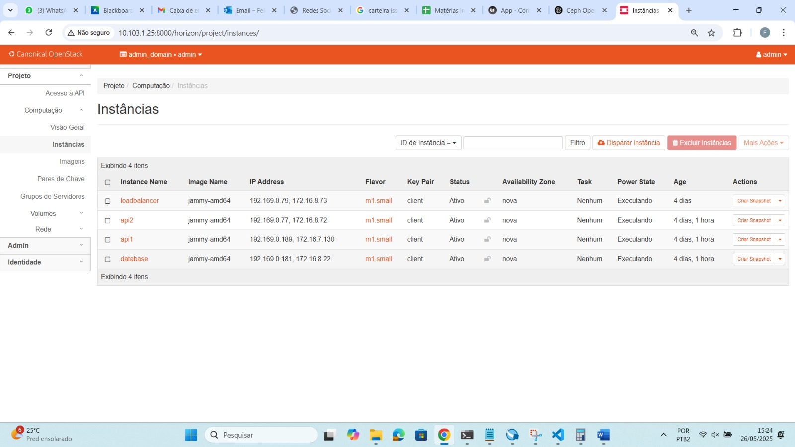

#### Aba *Network Topology*
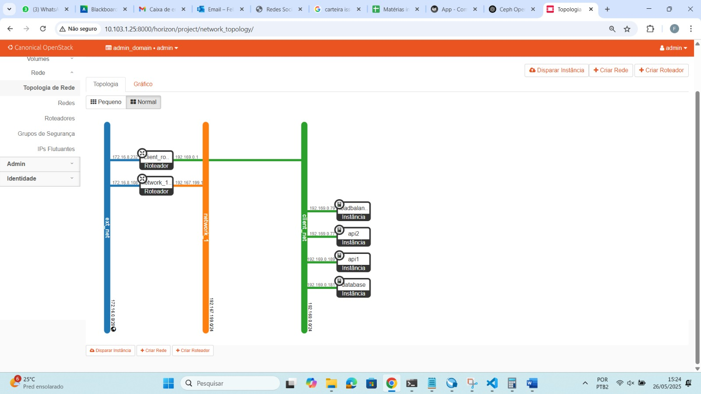

### User **Felipe**:
#### Aba *Compute Overview*
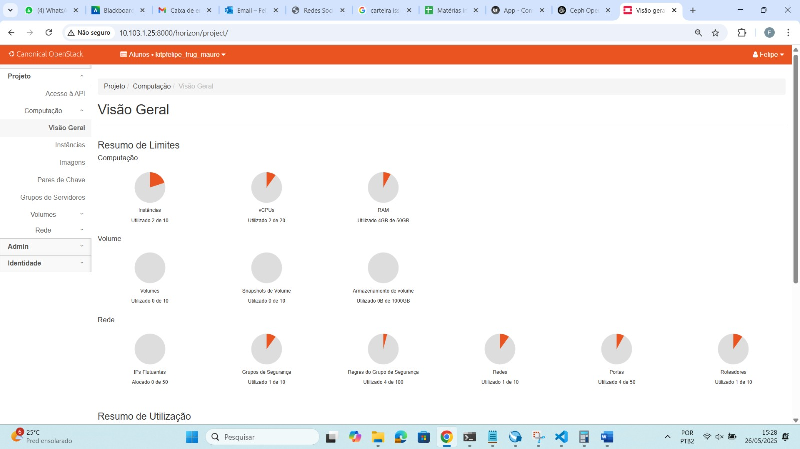

#### Aba *Compute Instances*
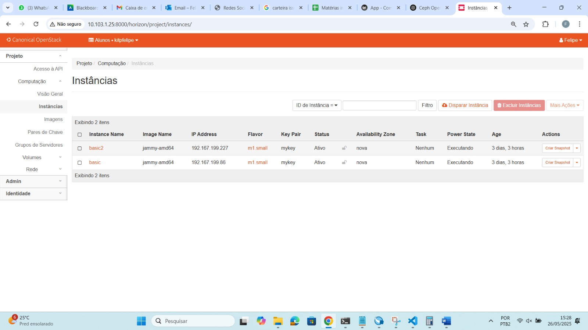

#### Aba *Network Topology*
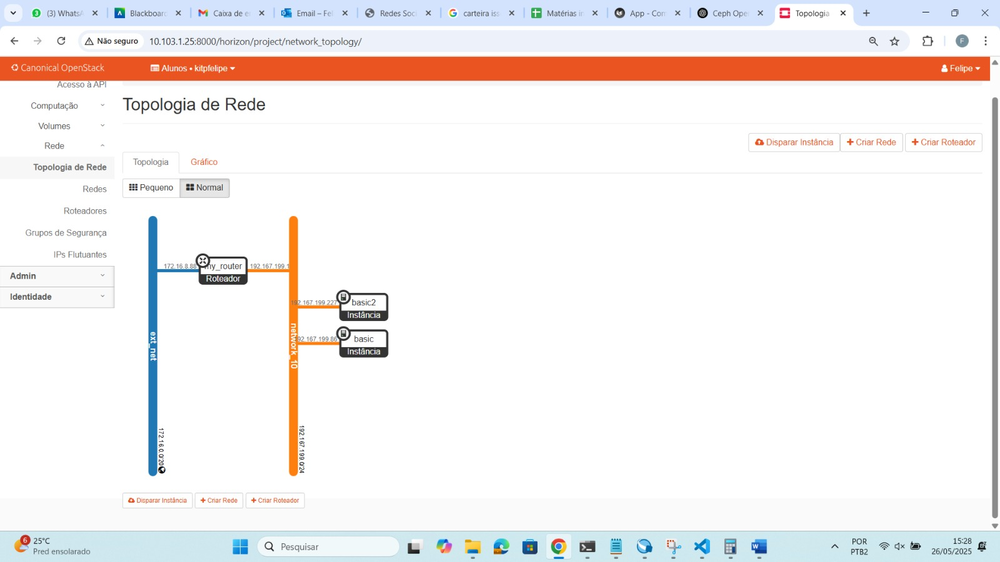

### User **Alberto**:
#### Aba *Compute Overview*
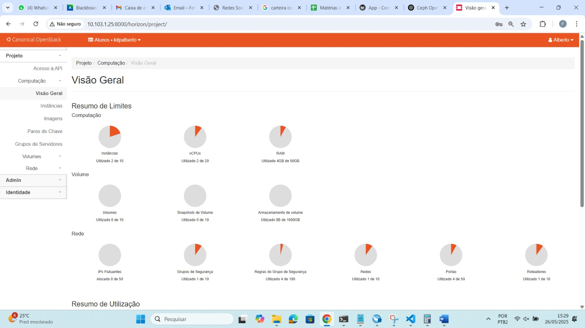
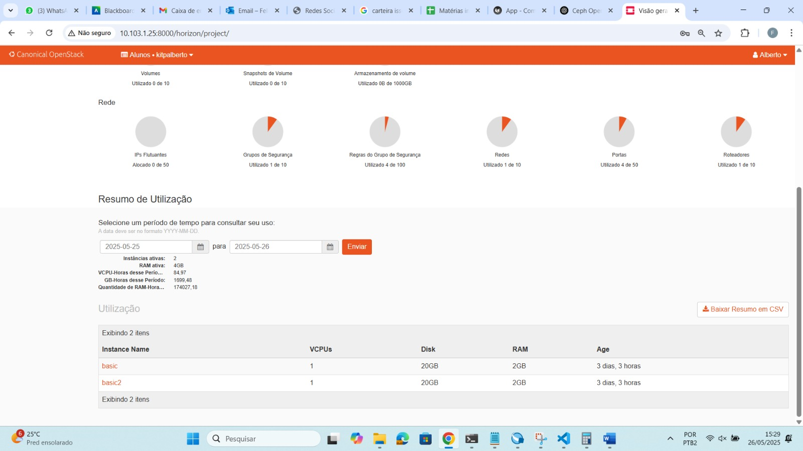

#### Aba *Compute Instances*
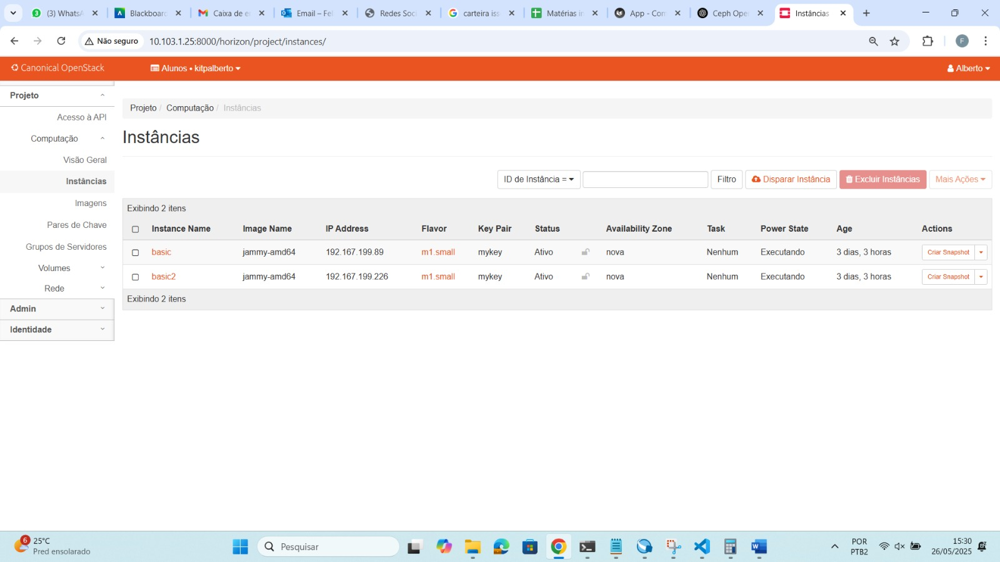

#### Aba *Network Topology*

### User **João**:
#### Aba *Compute Overview*
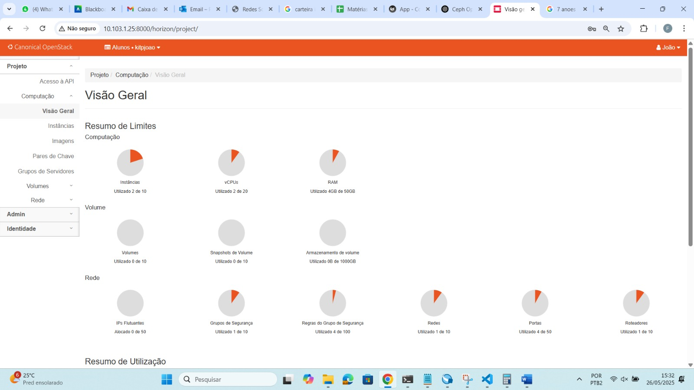
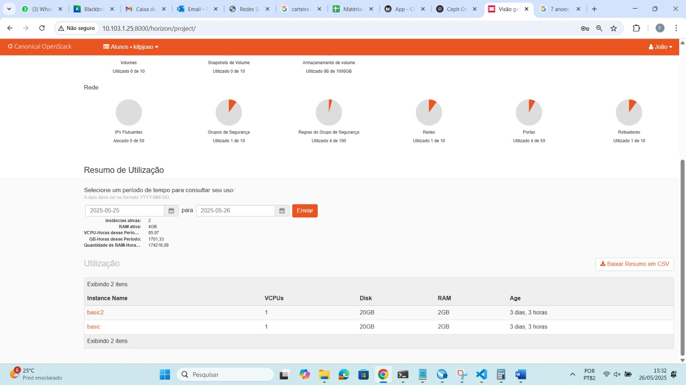

#### Aba *Compute Instances*
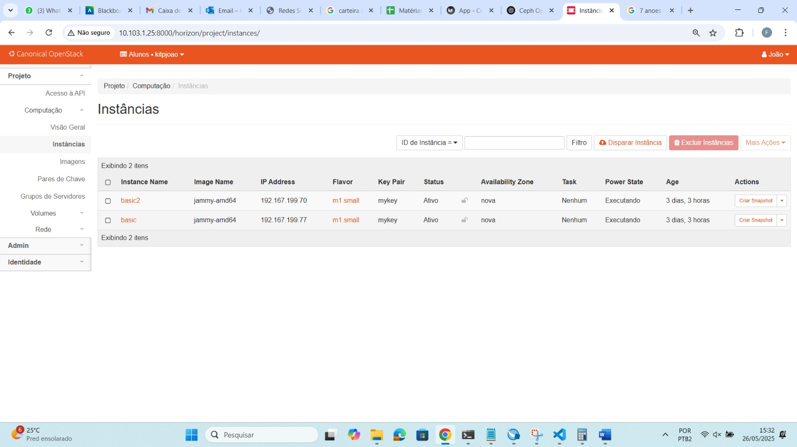

#### Aba *Network Topology*
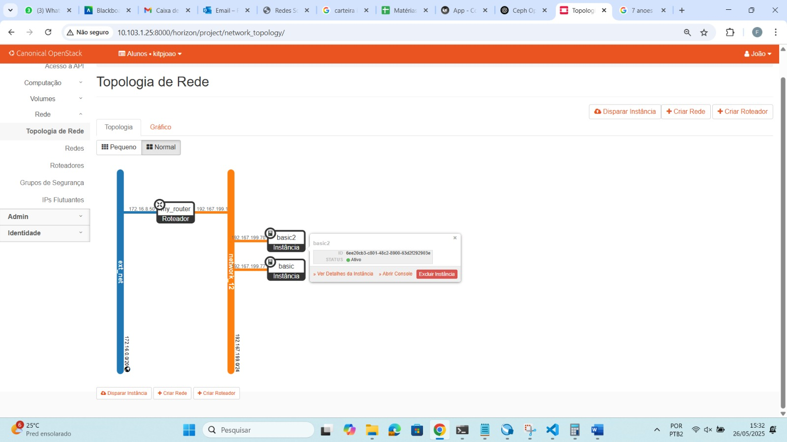

## Exercício 2
O grupo foi apresentado para a seguinte situação: "Você é o CTO (Chief Technology Officer) de uma grande empresa com sede em várias capitais no Brasil e precisa implantar um sistema crítico, de baixo custo e com dados sigilosos para a área operacional." \
Com essa situação em mente o grupo deveria responder a série de perguntas à seguir.

### a) Você escolheria Public Cloud ou Private Cloud?
O grupo escolheria uma **Public CLoud**. Isso se da por diversos motivos, porém os principais deles são escalabilidade, custo e segurança. \
Serviços como a AWS permitem escalar os recursos conforme a demanda, o que facilitaria colocar um modelo, mais simples, em prática no começo. Essa escolha também permitiria reduzir o custo inicial de instalação e setup de um serviço de cloud, ao mesmo tempo que facilita o controle de gastos destinados ao projeto. Por fim, a segurança é um ponto forte nesse modelo, uma vez que serviços com a AWS oferece recursos robustos de segurança e criptografia avançada, evitando erros de uma equipe mais reduzida que poderia errar e causar vazamentos de dados.

### b) Explique para o RH por que você precisa de um time de DevOps
Um time de DevOps é extremamente necessário, uma vez que essa é a maneira mais fácil de garantir eficiência, agilidade e segurança nas operações do sistema e desenvolvimento. \
A equipe teria alguns trabalhos principais, entre eles garantir deplays rápidos, seguros e confiáveis. Um trabalho de monitoramento seria essencial para reduzir danos e, principalmente, prever falhas. Por fim, trabalhariam com infraestrutura como código (IaC), para garantir um melhor gerenciamento da infraestrutura, utilizando ferramentas com o Terraform.

### c) Monte um plano de DR (Disaster Recovery) e HA (High Availability) que considere entre as ações:
#### Mapeamento das principais ameaças que podem colocar em riscos o seu ambiente
Falhas humanas, de software ou hardware podem causar com que os serviços de cloud sejam interrompidos. Entre essas falhas podem acontecer configurações mal feitas ou exclusão acidental de arquivos, atualizações problemáticas ou bugs e por fim problemas físicos nos servidores. \
Além dessas ameaças também é preciso ter conciencia que os servidores da empresa podem ser alvos de ataques intencionais. Alguns exemplos seriam ataques DDoS que visam derrubar e/ou sobrecarregar os servidores. Ou também, tentativas de acesso de terceiro, que podem ter intenções maliciosas com as informações ou com o proprio servidor.

#### Elenque e priorize as ações para a recuperação de seu ambiente em uma possível interrupção/desastre
No caso do pior acontecer é necessário ter planos para mitigar o estrago. \
Sabendo disso, algumas medidas podem ser tomadas. Entre elas, replicar os serviços mais importantes em diferentes áreas da Cloud, assim não se perderia tudo de uma vez. Ainda sobre dados, implementar um sistema de backup automático e rotineiro de dados críticos, preservaria os mesmos em caso de perda. Por fim, realizar testes frequêntes de *Disaster Recovery*, para que um plano ja estesja traçado para cada tipo de erro ou falha que possa vir a acontecer.

#### Como sua equipe irá tratar a política de backup?
Os backups devem ser realizados com frequência, para minizar qualquer tipo de dano ou perda proveniente de catastrofes. Alguns serviços como o *AWS Backup* poderiam ser utilizados para automatizar o processo, ao mesmo tempo que o facilita, à fim das mesmas finalidades dos backups frequêntes. Também poderia-se aplicar uma prioritização dos dados, para que os dados mais críticos fossem armazenados com mais frequência e facilidade de serem recuperados. \
Por fim, realizar testes para confirmar a integridade dos backups, se estão sendo arquivados de maneira correta e sem perda de nenhum documento crítico.

#### Considerando possíveis instabilidades e problemas, descreva como alta disponibilidade será implementada em sua infraestrutura
Realizar a distribuição automática do tráfego seria indispensável, então a utilização de um *Load Balancer* permitiria que diferentes intâncias fossem utilizadas para manejar todo o tráfego destinado ao serviço. \
A *Infraestrutura como Código* (IaC) garantiria a padronização e automatização da implantação, confirmando uma consistência entre os diversos ambientes da Cloud.\
Garantir que a demanda nunca sobrepasse a capacidade computacional da Cloud e manter um monitoramento frequênte seriam as duas últimas etapas providenciais para um bom funcionamento da Cloud. 